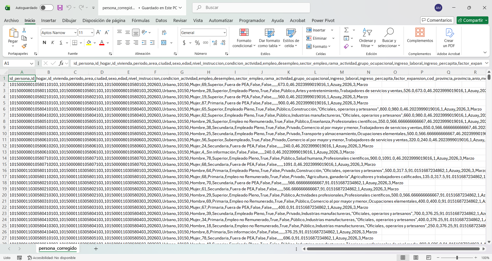
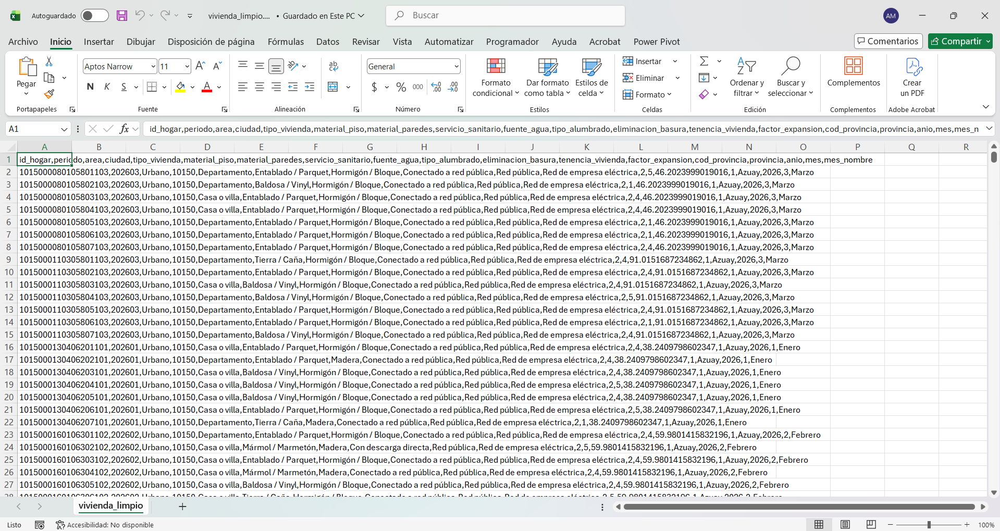

# Escuela Politécnica Nacional
### Facultad de Ingeniería de Sistemas

**Business Intelligence (ISWD743) · GR2SW_2026-1**

**Proyecto I Bimestre**

---

**Fecha:**  
29 de Mayo, 2026

**Integrantes:**  
José Arias · Andrea Chicaiza · Andreina Pallo · Juan Quisilema · Juan Suárez

---

<h2><strong>Caso de estudio:</strong></h2>

# Mercado Laboral y Vivienda en Ecuador

*Fuente de datos: ENEMDU Q1 2026 · INEC Ecuador*

---

## Tabla de contenidos

- [Escuela Politécnica Nacional](#escuela-politécnica-nacional)
    - [Facultad de Ingeniería de Sistemas](#facultad-de-ingeniería-de-sistemas)
- [Mercado Laboral y Vivienda en Ecuador](#mercado-laboral-y-vivienda-en-ecuador)
  - [Tabla de contenidos](#tabla-de-contenidos)
  - [Introducción](#introducción)
  - [Objetivo](#objetivo)
  - [Datasets](#datasets)
  - [1. Problema y solución](#1-problema-y-solución)
    - [1.1 ¿Qué es la ENEMDU y por qué se usa?](#11-qué-es-la-enemdu-y-por-qué-se-usa)
    - [1.2 Descripción de los datasets](#12-descripción-de-los-datasets)
      - [Dataset N°1: persona\_corregido.csv](#dataset-n1-persona_corregidocsv)
      - [Dataset N°2: vivienda\_limpio.csv](#dataset-n2-vivienda_limpiocsv)
    - [1.3 Preguntas de negocio](#13-preguntas-de-negocio)
    - [1.4 Stack tecnológico](#14-stack-tecnológico)
  - [2. Justificación de diseño y modelado dimensional](#2-justificación-de-diseño-y-modelado-dimensional)
  - [3. Proceso ETL](#3-proceso-etl)
    - [3.1 Staging](#31-staging)
    - [3.2 Dimensiones (tiempo, geografía, persona, ocupación)](#32-dimensiones-tiempo-geografía-persona-ocupación)
    - [3.3 Dimensiones (vivienda, servicios)](#33-dimensiones-vivienda-servicios)
    - [3.4 Tablas de hechos](#34-tablas-de-hechos)
    - [3.5 Job principal](#35-job-principal)
  - [4. Análisis de insights (OLAP)](#4-análisis-de-insights-olap)
  - [5. Recomendaciones al negocio](#5-recomendaciones-al-negocio)
  - [Referencias Bibliográficas](#referencias-bibliográficas)

---

## Introducción

La Encuesta Nacional de Empleo, Desempleo y Subempleo (ENEMDU) es el principal instrumento estadístico del Ecuador para medir las condiciones del mercado laboral y de vida de los hogares, producida periódicamente por el INEC con representatividad nacional. Este proyecto toma los datos del Q1 2026 (enero–marzo) para construir una solución de Business Intelligence end-to-end: desde la carga y transformación de los datos en Pentaho hacia un modelo dimensional en PostgreSQL, hasta la generación de reportes OLAP interactivos en Power BI que permitan responder preguntas concretas sobre empleo, ingresos y condiciones de vivienda en el Ecuador.

## Objetivo

Desarrollar una solución de inteligencia de negocios que recolecte datos reales del Ecuador, los transforme y cargue en un modelo analítico (ETL) en Pentaho y muestre reportes OLAP en Power BI.

---

## Datasets

| Dataset | Filas | Columnas | Granularidad |
|---|---|---|---|
| `persona_corregido.csv` | 82.894 | 23 | 1 persona por 1 período |
| `vivienda_limpio.csv` | 26.354 | 18 | 1 hogar por 1 período |

---

## 1. Problema y solución

### 1.1 ¿Qué es la ENEMDU y por qué se usa?

La Encuesta Nacional de Empleo, Desempleo y Subempleo (ENEMDU) es el principal instrumento estadístico del Ecuador para medir las condiciones del mercado laboral y las condiciones de vida de los hogares, producida por el INEC con representatividad urbana y rural en las 24 provincias del país [[1]](#referencias).

Para este proyecto se utiliza la edición Q1 2026 (enero, febrero y marzo) por las siguientes razones:

- Es la fuente oficial del Estado ecuatoriano sobre empleo e ingresos.
- Incluye el factor de expansión muestral, que permite proyectar resultados a la población nacional.
- Combina información de personas y hogares en la misma muestra, habilitando análisis cruzados entre mercado laboral y condiciones de vivienda.

---

### 1.2 Descripción de los datasets

#### Dataset N°1: persona_corregido.csv

|  |
| :---: |
| *Figura 1: Vista previa del dataset 'persona_corregido.csv*' |

Registra información individual de cada persona encuestada durante los tres meses del Q1 2026. Cubre cuatro grandes bloques temáticos: 

- **Identificación:** claves de persona y hogar
- **Perfil Demográfico:** sexo, edad, nivel de instrucción,
- **Situación Laboral:** condición de actividad, sector, rama, grupo ocupacional, flags de empleo y desempleo
- **Ingresos:** laboral y per cápita 

Incluye además las variables de geografía y tiempo que lo vinculan con el dataset de vivienda.

| Campo | Tipo | Descripción |
|---|---|---|
| `id_persona` | VARCHAR | Identificador único de la persona |
| `id_hogar` | VARCHAR | Identificador del hogar al que pertenece la persona |
| `id_vivienda` | INT | Identificador de la vivienda |
| `periodo` | INT | Período de la encuesta: 202601, 202602, 202603 |
| `area` | VARCHAR | Zona geográfica: Urbano / Rural |
| `ciudad` | INT | Código INEC de parroquia |
| `sexo` | VARCHAR | Sexo de la persona: Hombre / Mujer |
| `edad` | INT | Edad en años (rango: 0–98) |
| `nivel_instruccion` | VARCHAR | Nivel educativo alcanzado: Ninguno, Primaria, Secundaria, Superior, Centro de Alfabetización |
| `condicion_actividad` | VARCHAR | Situación en el mercado laboral: Empleado Pleno, Subempleado, Desempleado Abierto, Desempleado Oculto, Inactivo, Fuera de PEA, entre otros |
| `empleo` | BOOLEAN | Indica si la persona está empleada |
| `desempleo` | BOOLEAN | Indica si la persona está desempleada |
| `sector_empleo` | VARCHAR | Sector de trabajo: Público, Privado, Doméstico, No Remunerado, Sin información |
| `rama_actividad` | VARCHAR | Rama económica CIIU (21 categorías) |
| `grupo_ocupacional` | VARCHAR | Grupo ocupacional CIUO (10 categorías) |
| `ingreso_laboral` | DECIMAL | Ingreso mensual laboral en USD |
| `ingreso_percapita` | DECIMAL | Ingreso per cápita del hogar en USD |
| `factor_expansion` | DECIMAL | Ponderador muestral para proyección a nivel nacional |
| `cod_provincia` | INT | Código numérico de provincia (1–24) |
| `provincia` | VARCHAR | Nombre de la provincia (24 provincias del Ecuador) |
| `anio` | INT | Año de la encuesta |
| `mes` | INT | Mes numérico: 1, 2, 3 |
| `mes_nombre` | VARCHAR | Nombre del mes: Enero, Febrero, Marzo |

---

#### Dataset N°2: vivienda_limpio.csv

|  |
| :---: |
| *Figura 2: Vista previa del dataset 'vivienda_limpio.csv'* |

Registra las condiciones de cada hogar encuestado durante el Q1 2026. Cubre dos bloques temáticos principales: 
- **Características físicas de la vivienda:** tipo, materiales de piso y paredes, tenencia.
- **Acceso a servicios básicos:** fuente de agua, alumbrado, saneamiento y recolección de basura.

Además, comparte con el dataset de persona las variables de identificación del hogar, geografía y tiempo.  

| Campo | Tipo | Descripción |
|---|---|---|
| `id_hogar` | VARCHAR | Identificador único del hogar |
| `periodo` | INT | Período de la encuesta: 202601, 202602, 202603 |
| `area` | VARCHAR | Zona geográfica: Urbano / Rural |
| `ciudad` | INT | Código INEC de parroquia |
| `tipo_vivienda` | VARCHAR | Tipo de vivienda: Casa o villa, Departamento, Mediagua, Rancho, Cuarto inquilinato, Covacha, Choza/Otro |
| `material_piso` | VARCHAR | Material del piso: Entablado/Parquet, Baldosa/Vinyl, Ladrillo/Cemento, Mármol, Madera, Tierra/Caña, Piedra, Otro |
| `material_paredes` | VARCHAR | Material de las paredes: Hormigón/Bloque, Adobe/Tapia, Madera, Caña revestida, Caña no revestida, Otros, Sin paredes |
| `servicio_sanitario` | VARCHAR | Tipo de servicio sanitario: Conectado a red pública, Pozo séptico, Descarga directa, Letrina, No tiene |
| `fuente_agua` | VARCHAR | Fuente de abastecimiento de agua: Red pública, Otra tubería, Pozo, Río/Vertiente, Agua lluvia, Pila pública, Carro repartidor |
| `tipo_alumbrado` | VARCHAR | Fuente de energía eléctrica: Red de empresa eléctrica, Panel solar, Generador, Otro |
| `eliminacion_basura` | INT | Forma de eliminación de basura (código INEC 1–5) |
| `tenencia_vivienda` | INT | Tipo de tenencia de la vivienda (código INEC 1–6) |
| `factor_expansion` | DECIMAL | Ponderador muestral para proyección a nivel nacional |
| `cod_provincia` | INT | Código numérico de provincia (1–24) |
| `provincia` | VARCHAR | Nombre de la provincia (24 provincias del Ecuador) |
| `anio` | INT | Año de la encuesta |
| `mes` | INT | Mes numérico: 1, 2, 3 |
| `mes_nombre` | VARCHAR | Nombre del mes: Enero, Febrero, Marzo |

---

### 1.3 Preguntas de negocio
Con base en los datos disponibles, se definieron cinco preguntas de negocio orientadas a extraer hallazgos concretos sobre el mercado laboral y las condiciones de vida en el Ecuador. Estas preguntas guiaron todo el proyecto, desde el diseño del modelo dimensional hasta la construcción de los reportes OLAP en Power BI.

| # | Pregunta |
|---|---|
| **P1** | ¿Cómo varía la tasa de empleo y el ingreso laboral promedio entre zonas urbanas y rurales, y entre provincias? |
| **P2** | ¿Existe una brecha salarial significativa según sexo, nivel de instrucción y sector de empleo? |
| **P3** | ¿Qué porcentaje de hogares carece de agua potable, electricidad de red pública o saneamiento adecuado, y cómo se distribuye por provincia? |
| **P4** | ¿Cómo evolucionaron las tasas de empleo y desempleo mes a mes durante enero, febrero y marzo de 2026? |
| **P5** | ¿Existe correlación entre el índice de acceso a servicios básicos de un hogar y el ingreso per cápita de sus miembros? |

---

### 1.4 Stack tecnológico

| Etapa | Herramienta | Rol |
|---|---|---|
| ETL |  Pentaho Data Integration | Staging → dimensiones → hechos, con transformaciones de negocio |
| Almacenamiento |  PostgreSQL | Data warehouse dimensional |
| Visualización OLAP |  Power BI Desktop | Reportes interactivos, medidas DAX, jerarquías y slicers |

---
---
## 2. Justificación de diseño y modelado dimensional

|  |
| :---: |
| *Figura 3: Descripción* |

---
---
## 3. Proceso ETL

### 3.1 Staging

### 3.2 Dimensiones (tiempo, geografía, persona, ocupación)

### 3.3 Dimensiones (vivienda, servicios)

### 3.4 Tablas de hechos

### 3.5 Job principal

---
---
## 4. Análisis de insights (OLAP)

---
---
## 5. Recomendaciones al negocio

---
---
## Referencias Bibliográficas   

[1] Instituto Nacional de Estadística y Censos (INEC), "Estadísticas Laborales – abril 2026: Encuesta Nacional de Empleo, Desempleo y Subempleo (ENEMDU)," INEC Ecuador, 2026. [En línea]. Disponible en: https://www.ecuadorencifras.gob.ec/estadisticas-laborales-enemdu/ [Accedido: may. 2026].