<div align="center">


<h1><strong>Escuela Politécnica Nacional</strong></h1>

### Facultad de Ingeniería de Sistemas

**Business Intelligence (ISWD743) · GR2SW_2026-1**

**Proyecto I Bimestre**

---

**Fecha:**  
29 de Mayo, 2026

**Integrantes:**  
José Arias · Andrea Chicaiza · Andreina Pallo · Juan Quisilema · Juan Suárez

---

<h2><strong>Caso de estudio:</strong></h2>

# Mercado Laboral y Vivienda en Ecuador

*Fuente de datos: ENEMDU Q1 2026 · INEC Ecuador*


</div>

---
<h2><strong>Tabla de contenidos</strong></h2>

- [Mercado Laboral y Vivienda en Ecuador](#mercado-laboral-y-vivienda-en-ecuador)
  - [Introducción](#introducción)
  - [Objetivo](#objetivo)
  - [Datasets](#datasets)
  - [1. Problema y solución](#1-problema-y-solución)
    - [1.1 ¿Qué es la ENEMDU y por qué se usa?](#11-qué-es-la-enemdu-y-por-qué-se-usa)
    - [1.2 Descripción de los datasets](#12-descripción-de-los-datasets)
      - [Dataset N°1: persona\_corregido.csv](#dataset-n1-persona_corregidocsv)
      - [Dataset N°2: vivienda\_limpio.csv](#dataset-n2-vivienda_limpiocsv)
    - [1.3 Preguntas de negocio](#13-preguntas-de-negocio)
    - [1.4 Stack tecnológico](#14-stack-tecnológico)
  - [2. Justificación de diseño y modelado dimensional](#2-justificación-de-diseño-y-modelado-dimensional)
  - [3. Proceso ETL](#3-proceso-etl)
    - [3.1 Staging](#31-staging)
    - [3.2 Dimensiones (tiempo, geografía, persona, ocupación)](#32-dimensiones-tiempo-geografía-persona-ocupación)
    - [3.3 Dimensiones (vivienda, servicios)](#33-dimensiones-vivienda-servicios)
    - [3.4 Tablas de hechos](#34-tablas-de-hechos)
    - [3.5 Job principal](#35-job-principal)
  - [4. Análisis de insights (OLAP)](#4-análisis-de-insights-olap)
  - [5. Recomendaciones al negocio](#5-recomendaciones-al-negocio)
  - [Referencias Bibliográficas](#referencias-bibliográficas)

---

## Introducción

La Encuesta Nacional de Empleo, Desempleo y Subempleo (ENEMDU) es el principal instrumento estadístico del Ecuador para medir las condiciones del mercado laboral y de vida de los hogares, producida periódicamente por el INEC con representatividad nacional. Este proyecto toma los datos del Q1 2026 (enero–marzo) para construir una solución de Business Intelligence end-to-end: desde la carga y transformación de los datos en Pentaho hacia un modelo dimensional en PostgreSQL, hasta la generación de reportes OLAP interactivos en Power BI que permitan responder preguntas concretas sobre empleo, ingresos y condiciones de vivienda en el Ecuador.

## Objetivo

### Objetivo General

Desarrollar una solución de inteligencia de negocios end-to-end sobre los datos de la ENEMDU Q1 2026, que integre un proceso ETL completo en Pentaho Data Integration, un modelo dimensional de tipo constelación en PostgreSQL, y reportes OLAP interactivos en Power BI, con el fin de analizar la situación del mercado laboral y las condiciones de vivienda en el Ecuador durante el primer trimestre de 2026.

### Objetivos Específicos

- Implementar un proceso ETL que extraiga, limpie y cargue los datos de `persona_corregido.csv` y `vivienda_limpio.csv` desde staging hasta un modelo dimensional validado en PostgreSQL.
- Diseñar un esquema constelación con dos tablas de hechos (`fact_situacion_laboral` y `fact_condicion_hogar`) y seis dimensiones, justificando las decisiones de granularidad, surrogate keys y normalización.
- Construir un dashboard OLAP en Power BI con visualizaciones interactivas que respondan las cuatro preguntas de negocio definidas.
- Identificar hallazgos concretos sobre empleo, ingresos y acceso a servicios básicos en el Ecuador, y formular recomendaciones de negocio  basadas en los datos.

---

## Datasets

| Dataset | Filas | Columnas | Granularidad |
|---|---|---|---|
| `persona_corregido.csv` | 82.894 | 23 | 1 persona por 1 período |
| `vivienda_limpio.csv` | 26.354 | 18 | 1 hogar por 1 período |


---

## 1. Problema y solución

### 1.1 ¿Qué es la ENEMDU y por qué se usa?

La Encuesta Nacional de Empleo, Desempleo y Subempleo (ENEMDU) es el principal instrumento estadístico del Ecuador para medir las condiciones del mercado laboral y las condiciones de vida de los hogares, producida por el INEC con representatividad urbana y rural en las 24 provincias del país [[1]](#referencias).

Para este proyecto se utiliza la edición Q1 2026 (enero, febrero y marzo) por las siguientes razones:

- Es la fuente oficial del Estado ecuatoriano sobre empleo e ingresos.
- Incluye el factor de expansión muestral, que permite proyectar resultados a la población nacional.
- Combina información de personas y hogares en la misma muestra, habilitando análisis cruzados entre mercado laboral y condiciones de vivienda.


---

### 1.2 Descripción de los datasets

#### Dataset N°1: persona_corregido.csv

|  |
| :---: |
| *Figura 1: Vista previa del dataset 'persona_corregido.csv*' |

Registra información individual de cada persona encuestada durante los tres meses del Q1 2026. Cubre cuatro grandes bloques temáticos: 

- **Identificación:** claves de persona y hogar
- **Perfil Demográfico:** sexo, edad, nivel de instrucción,
- **Situación Laboral:** condición de actividad, sector, rama, grupo ocupacional, flags de empleo y desempleo
- **Ingresos:** laboral y per cápita 

Incluye además las variables de geografía y tiempo que lo vinculan con el dataset de vivienda.


| Campo | Tipo | Descripción |
|---|---|---|
| `id_persona` | VARCHAR | Identificador único de la persona |
| `id_hogar` | VARCHAR | Identificador del hogar al que pertenece la persona |
| `id_vivienda` | INT | Identificador de la vivienda |
| `periodo` | INT | Período de la encuesta: 202601, 202602, 202603 |
| `area` | VARCHAR | Zona geográfica: Urbano / Rural |
| `ciudad` | INT | Código INEC de parroquia |
| `sexo` | VARCHAR | Sexo de la persona: Hombre / Mujer |
| `edad` | INT | Edad en años (rango: 0–98) |
| `nivel_instruccion` | VARCHAR | Nivel educativo alcanzado: Ninguno, Primaria, Secundaria, Superior, Centro de Alfabetización |
| `condicion_actividad` | VARCHAR | Situación en el mercado laboral: Empleado Pleno, Subempleado, Desempleado Abierto, Desempleado Oculto, Inactivo, Fuera de PEA, entre otros |
| `empleo` | BOOLEAN | Indica si la persona está empleada |
| `desempleo` | BOOLEAN | Indica si la persona está desempleada |
| `sector_empleo` | VARCHAR | Sector de trabajo: Público, Privado, Doméstico, No Remunerado, Sin información |
| `rama_actividad` | VARCHAR | Rama económica CIIU (21 categorías) |
| `grupo_ocupacional` | VARCHAR | Grupo ocupacional CIUO (10 categorías) |
| `ingreso_laboral` | DECIMAL | Ingreso mensual laboral en USD |
| `ingreso_percapita` | DECIMAL | Ingreso per cápita del hogar en USD |
| `factor_expansion` | DECIMAL | Ponderador muestral para proyección a nivel nacional |
| `cod_provincia` | INT | Código numérico de provincia (1–24) |
| `provincia` | VARCHAR | Nombre de la provincia (24 provincias del Ecuador) |
| `anio` | INT | Año de la encuesta |
| `mes` | INT | Mes numérico: 1, 2, 3 |
| `mes_nombre` | VARCHAR | Nombre del mes: Enero, Febrero, Marzo |


---

#### Dataset N°2: vivienda_limpio.csv

|  |
| :---: |
| *Figura 2: Vista previa del dataset 'vivienda_limpio.csv'* |

Registra las condiciones de cada hogar encuestado durante el Q1 2026. Cubre dos bloques temáticos principales: 
- **Características físicas de la vivienda:** tipo, materiales de piso y paredes, tenencia.
- **Acceso a servicios básicos:** fuente de agua, alumbrado, saneamiento y recolección de basura.

Además, comparte con el dataset de persona las variables de identificación del hogar, geografía y tiempo.  


| Campo | Tipo | Descripción |
|---|---|---|
| `id_hogar` | VARCHAR | Identificador único del hogar |
| `periodo` | INT | Período de la encuesta: 202601, 202602, 202603 |
| `area` | VARCHAR | Zona geográfica: Urbano / Rural |
| `ciudad` | INT | Código INEC de parroquia |
| `tipo_vivienda` | VARCHAR | Tipo de vivienda: Casa o villa, Departamento, Mediagua, Rancho, Cuarto inquilinato, Covacha, Choza/Otro |
| `material_piso` | VARCHAR | Material del piso: Entablado/Parquet, Baldosa/Vinyl, Ladrillo/Cemento, Mármol, Madera, Tierra/Caña, Piedra, Otro |
| `material_paredes` | VARCHAR | Material de las paredes: Hormigón/Bloque, Adobe/Tapia, Madera, Caña revestida, Caña no revestida, Otros, Sin paredes |
| `servicio_sanitario` | VARCHAR | Tipo de servicio sanitario: Conectado a red pública, Pozo séptico, Descarga directa, Letrina, No tiene |
| `fuente_agua` | VARCHAR | Fuente de abastecimiento de agua: Red pública, Otra tubería, Pozo, Río/Vertiente, Agua lluvia, Pila pública, Carro repartidor |
| `tipo_alumbrado` | VARCHAR | Fuente de energía eléctrica: Red de empresa eléctrica, Panel solar, Generador, Otro |
| `eliminacion_basura` | INT | Forma de eliminación de basura (código INEC 1–5) |
| `tenencia_vivienda` | INT | Tipo de tenencia de la vivienda (código INEC 1–6) |
| `factor_expansion` | DECIMAL | Ponderador muestral para proyección a nivel nacional |
| `cod_provincia` | INT | Código numérico de provincia (1–24) |
| `provincia` | VARCHAR | Nombre de la provincia (24 provincias del Ecuador) |
| `anio` | INT | Año de la encuesta |
| `mes` | INT | Mes numérico: 1, 2, 3 |
| `mes_nombre` | VARCHAR | Nombre del mes: Enero, Febrero, Marzo |

---

### 1.3 Preguntas de negocio
Con base en los datos disponibles, se definieron cinco preguntas de negocio orientadas a extraer hallazgos concretos sobre el mercado laboral y las condiciones de vida en el Ecuador. Estas preguntas guiaron todo el proyecto, desde el diseño del modelo dimensional hasta la construcción de los reportes OLAP en Power BI.

| # | Pregunta |
|---|---|
| **P1** | ¿Cómo varía la tasa de empleo y el ingreso laboral promedio entre zonas urbanas y rurales, y entre provincias? |
| **P2** | ¿Existe una brecha salarial significativa según sexo, nivel de instrucción y sector de empleo? |
| **P3** | ¿Qué porcentaje de hogares carece de agua potable, electricidad de red pública o saneamiento adecuado, y cómo se distribuye por provincia? |
| **P4** | ¿Cómo evolucionaron las tasas de empleo y desempleo mes a mes durante enero, febrero y marzo de 2026? |

---

### 1.4 Stack tecnológico

| Etapa | Herramienta | Rol |
|---|---|---|
| ETL |  Pentaho Data Integration | Staging → dimensiones → hechos, con transformaciones de negocio |
| Almacenamiento |  PostgreSQL | Data warehouse dimensional |
| Visualización OLAP |  Power BI Desktop | Reportes interactivos, medidas DAX, jerarquías y slicers |


---
---
## 2. Justificación de diseño y modelado dimensional

### 2.1 Por qué constelación
 
El modelo dimensional elegido para este proyecto es el **modelo constelación**, también conocido como esquema de galaxia. Esta decisión responde a una característica estructural del conjunto de datos ENEMDU Q1 2026 los dos datasets fuente `persona_corregido.csv` y `vivienda_limpio.csv` que describen **procesos de negocio distintos con granularidades diferentes**, lo cual hace inviable tanto un esquema estrella simple como un esquema copo de nieve.
 
#### Diferencia de granularidad entre las dos tablas de hechos
 
| Tabla de hechos | Dataset origen | Granularidad | Filas | Unidad de observación |
|---|---|---|---|---|
| `FACT_SITUACION_LABORAL` | `persona_corregido.csv` | Una persona por periodo | 82.894 | Individuo × mes |
| `FACT_CONDICION_HOGAR` | `vivienda_limpio.csv` | Un hogar por periodo | 26.354 | Hogar × mes |
 
Mezclar ambas granularidades en una sola tabla de hechos produciría una **trampa de abanico** al unir los 82.894 registros de personas con los 26.354 registros de hogares a través de `id_hogar`, las métricas de vivienda se multiplicarían por el número de personas del hogar, inflando artificialmente los conteos. El modelo constelación resuelve esto manteniendo cada proceso de negocio en su propia tabla de hechos y conectándolas únicamente a través de dimensiones compartidas.
 
Adicionalmente, la integridad referencial entre ambas fuentes es del **100 %**. Es decir, los 26.354 hogares presentes en `vivienda_limpio.csv` coinciden exactamente con los identificadores de hogar en `persona_corregido.csv`, lo que garantiza que los cruces analíticos entre facts no generarán valores nulos ni pérdida de registros.
 
---
 
### 2.2 Las 6 dimensiones del modelo y cuáles son compartidas
 
El modelo está compuesto por **6 dimensiones**, de las cuales 2 son compartidas por ambas tablas de hechos y 4 son exclusivas de una de ellas.
 
#### Dimensiones compartidas
 
Estas dimensiones actúan como el núcleo de la constelación. En Power BI, un único slicer sobre cualquiera de ellas filtra simultáneamente `FACT_SITUACION_LABORAL` y `FACT_CONDICION_HOGAR`, permitiendo responder preguntas que cruzan la situación laboral con las condiciones del hogar.
 
**`DIM_TIEMPO`**
Construida a partir de las columnas `mes`, `mes_nombre` y `anio` presentes en ambos datasets. Se añade en Pentaho la columna derivada `orden_mes` (valores 1, 2, 3) para garantizar el ordenamiento cronológico correcto en los ejes de tiempo de Power BI, ya que el nombre del mes en texto ordena alfabonéticamente por defecto. Cardinalidad: 3 registros (Enero, Febrero, Marzo 2026).
 
**`DIM_GEOGRAFIA`**
Construida a partir de `area`, `provincia`, `cod_provincia` y `ciudad`. La columna `area` (Rural / Urbano) es el slicer geográfico principal para las preguntas de análisis P1 y P3. La columna `ciudad` contiene el código INEC (fórmula: `cod_provincia × 10.000 + parroquia`) y requiere un catálogo externo del INEC para resolver los nombres de parroquia; su cardinalidad es de 587 valores. La columna `provincia` —con sus 24 categorías— habilita visualizaciones de mapa de coropletas en Power BI. Los valores son idénticos entre ambos datasets para el mismo hogar (0 inconsistencias verificadas).
 
#### Dimensiones exclusivas de `FACT_SITUACION_LABORAL`
 
**`DIM_PERSONA`**
Contiene los atributos demográficos individuales: `sexo` (Hombre / Mujer), `nivel_instruccion` (5 categorías: Ninguno, Centro de Alfabetización, Primaria, Secundaria, Superior) y la columna derivada `grupo_etario`, que se construye en Pentaho a partir de la columna `edad`. Esta dimensión es la clave para responder la pregunta sobre brecha salarial de género por nivel de instrucción (P2).
 
**`DIM_OCUPACION`**
Contiene los atributos del mercado laboral: `condicion_actividad` (10 categorías, corregida en Python), `sector_empleo` (Público, Privado, Doméstico, No Remunerado, Sin información), `rama_actividad` (21 ramas CIIU) y `grupo_ocupacional` (10 grupos CIUO). En Pentaho se deriva la columna `categoria_pea` para clasificar a cada persona como Ocupada, Desempleada o Fuera de PEA, que es el denominador correcto para el cálculo de tasas de empleo y desempleo expandidas. Los 42.974 nulos estructurales en `sector_empleo`, `rama_actividad` y `grupo_ocupacional` corresponden a personas fuera de la PEA y se imputarán como `"No aplica"` en Pentaho.
 
#### Dimensiones exclusivas de `FACT_CONDICION_HOGAR`
 
**`DIM_TIPO_VIVIENDA`**
Contiene las características físicas de la unidad habitacional: `tipo_vivienda` (7 categorías: Casa o villa, Departamento, Mediagua, Rancho, Cuarto inquilinato, Covacha, Choza/Otro), `material_piso` (8 categorías), `material_paredes` (7 categorías) y `tenencia_vivienda`. Esta última llega como códigos numéricos 1–6 y requiere decodificación en Pentaho mediante Stream Lookup con el diccionario INEC.
 
**`DIM_SERVICIOS_BASICOS`**
Contiene el acceso a servicios públicos del hogar: `fuente_agua` (7 categorías, ya decodificada), `tipo_alumbrado` (4 categorías, ya decodificada), `servicio_sanitario` (5 categorías, ya decodificada) y `eliminacion_basura` (códigos 1–5, pendiente de decodificar en Pentaho). En Pentaho se derivan tres flags binarios: `agua_potable` (fuente_agua = "Red pública"), `electricidad_red` (tipo_alumbrado = "Red empresa eléctrica") y `saneamiento_adecuado` (servicio_sanitario = "Conectado a red pública"). Estos flags son las medidas directas para responder la pregunta P3.
 
---
 
### Diagrama ER del modelo constelación
 
El diagrama a continuación representa la estructura completa del modelo dimensional. Las tablas de hechos se ubican al centro; las dimensiones compartidas en la parte superior; las dimensiones exclusivas, agrupadas por tabla de hechos, en la parte inferior. Las relaciones son todas de tipo **muchos-a-uno** desde la tabla de hechos hacia la dimensión (notación: `*` → `1`).
 
 | 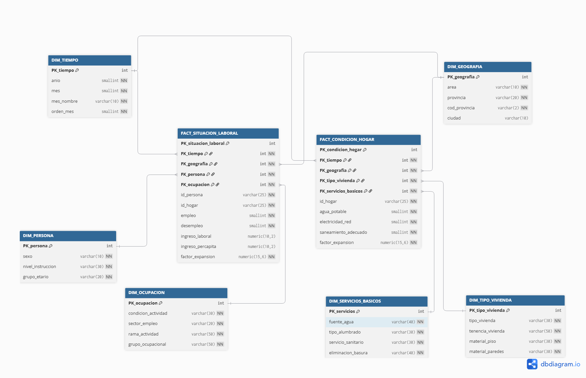 |
| :---: |
| *Figura 3: Diseño de esquema constelación* |
 
> **Nota:** La relación entre `FACT_SITUACION_LABORAL` y `FACT_CONDICION_HOGAR` a través de `id_hogar` no es una relación dimensional estándar; representa la integridad referencial del dataset de origen. En Power BI esta relación no se activa como relación de filtro entre facts; los cruces se realizan mediante medidas DAX que unen ambas facts a través de las dimensiones compartidas.


---
## 3. Proceso ETL

El proceso ETL fue implementado en **Pentaho Data Integration (PDI)** mediante 10 transformaciones (`.ktr`) y un job orquestador (`.kjb`). La base de datos de destino es **DbEnemdu** en PostgreSQL, organizada en un único schema `public` con convención de nombres por prefijo: `stg_` para staging, `dim_` para dimensiones y `fact_` para tablas de hechos.

Al inicio de cada transformación se configuró la **conexión a DbEnemdu** con los parámetros del servidor PostgreSQL local. Esta conexión se reutilizó en todos los pasos Table input, Database lookup y Table output de cada `.ktr`.


| 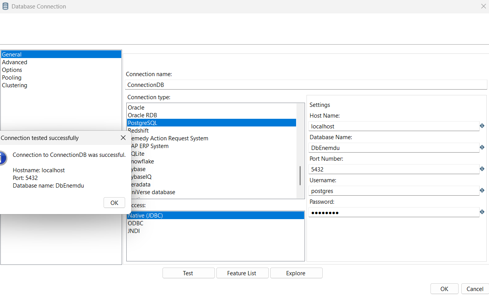 |
| :---: |
| *Figura 4: Conexión a DB* |

El orden de ejecución es estricto y responde a las dependencias del modelo: las tablas de staging deben existir antes de cargar dimensiones, y todas las dimensiones deben estar completas antes de cargar las facts, ya que éstas referencian a las dimensiones mediante claves foráneas.

```
FASE 1 — Staging
  load_stg_persona.ktr      → stg_persona    (82.894 filas)
  load_stg_vivienda.ktr     → stg_vivienda   (26.354 filas)

FASE 2 — Dimensiones compartidas
  dim_tiempo.ktr       → dim_tiempo     (3 filas)
  dim_geografia.ktr    → dim_geografia  (711 filas)

FASE 3 — Dimensiones exclusivas
  dim_persona.ktr      → dim_persona    (62 filas)
  dim_ocupacion.ktr    → dim_ocupacion  (968 filas)
  dim_tipo_vivienda.ktr    → dim_tipo_vivienda     (275 filas)
  dim_servicios.ktr        → dim_servicios_basicos (137 filas)

FASE 4 — Tablas de hechos
  fact_situacion_laboral.ktr → fact_situacion_laboral (82.894 filas)
  fact_condicion_hogar.ktr   → fact_condicion_hogar   (26.354 filas)
```

---

### 3.1 Staging

Las tablas de staging son réplicas exactas de los CSV fuente: mismos nombres de columna, mismo orden, sin transformaciones de negocio. Su propósito es aterrizar los datos en bruto en PostgreSQL para que las transformaciones posteriores operen sobre SQL en lugar de sobre archivos planos, lo que garantiza reproducibilidad y trazabilidad.

Ambas transformaciones comparten la misma estructura: **CSV file input → Table output**, con la opción *Truncate table* activada para garantizar idempotencia en re-ejecuciones.

> **Nota sobre el BOM:** Los archivos CSV fueron guardados originalmente con codificación UTF-8 BOM por Excel, lo que introducía el carácter invisible `` al inicio del nombre de la primera columna. Esto fue corregido convirtiendo ambos archivos a UTF-8 sin BOM mediante Notepad++ antes de la carga.

> **Nota sobre los IDs:** Los campos `id_persona`, `id_hogar` e `id_vivienda` contienen códigos INEC de 19–21 dígitos que Excel almacenó en notación científica (`1.015E+20`).

---

#### `load_stg_persona` — Carga de personas a staging

**DDL de la tabla:**

```sql
CREATE TABLE stg_persona (
    id_persona          VARCHAR(25),
    id_hogar            VARCHAR(25),
    id_vivienda         VARCHAR(25),
    periodo             INTEGER,
    area                VARCHAR(10),
    ciudad              INTEGER,
    sexo                VARCHAR(10),
    edad                INTEGER,
    nivel_instruccion   VARCHAR(30),
    condicion_actividad VARCHAR(30),
    empleo              VARCHAR(10),
    desempleo           VARCHAR(10),
    sector_empleo       VARCHAR(20),
    rama_actividad      VARCHAR(60),
    grupo_ocupacional   VARCHAR(60),
    ingreso_laboral     NUMERIC(10,2),
    ingreso_percapita   NUMERIC(10,2),
    factor_expansion    NUMERIC(15,6),
    cod_provincia       INTEGER,
    provincia           VARCHAR(20),
    anio                SMALLINT,
    mes                 SMALLINT,
    mes_nombre          VARCHAR(10)
);
```

**Canvas:**

| 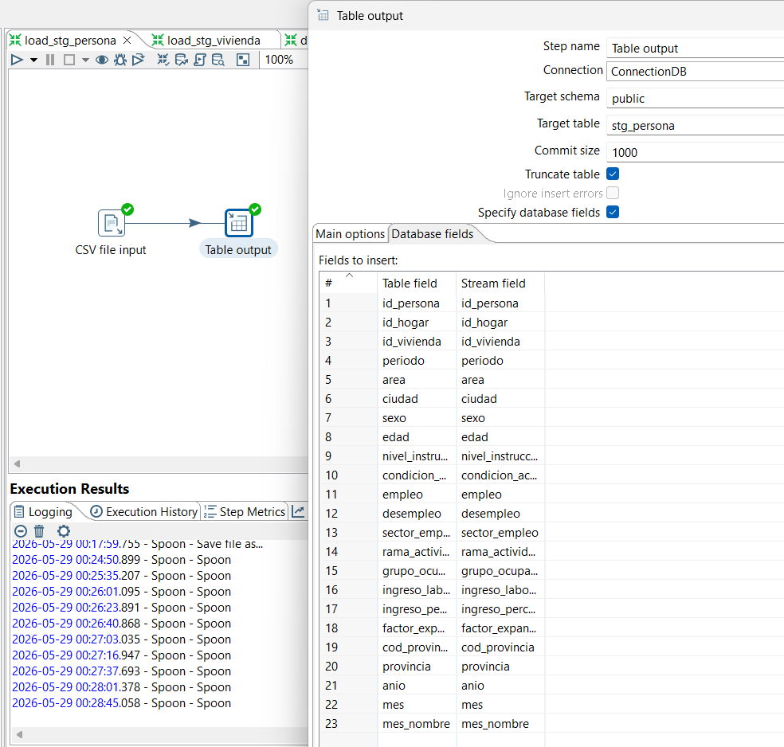 |
| :---: |
| *Figura 5: Transformación load_stg_persona — CSV file input → Table output* |

**Pasos:**

| # | Paso | Configuración clave |
|---|---|---|
| 1 | CSV file input | Archivo: `persona_corregido.csv` · Encoding: UTF-8 · Delimiter: `,` · Header row: ✓ · `id_persona`, `id_hogar`, `id_vivienda` → String · `empleo`, `desempleo` → String (llegan como `"True"`/`"False"`) · `ingreso_laboral`, `ingreso_percapita`, `factor_expansion` → Number |
| 2 | Table output | Tabla: `stg_persona` ·  Mapeo automático por nombre de columna |

**Transformaciones aplicadas:** Ninguna — carga directa sin modificaciones de negocio.

**Row count resultante:** 82.894 filas.

---

#### `load_stg_vivienda` — Carga de viviendas a staging

**DDL de la tabla:**

```sql
CREATE TABLE stg_vivienda (
    id_hogar            VARCHAR(25),
    periodo             INTEGER,
    area                VARCHAR(10),
    ciudad              INTEGER,
    tipo_vivienda       VARCHAR(40),
    material_piso       VARCHAR(30),
    material_paredes    VARCHAR(30),
    servicio_sanitario  VARCHAR(30),
    fuente_agua         VARCHAR(40),
    tipo_alumbrado      VARCHAR(30),
    eliminacion_basura  INTEGER,
    tenencia_vivienda   INTEGER,
    factor_expansion    NUMERIC(15,6),
    cod_provincia       INTEGER,
    provincia           VARCHAR(20),
    anio                SMALLINT,
    mes                 SMALLINT,
    mes_nombre          VARCHAR(10)
);
```

**Canvas:**

| 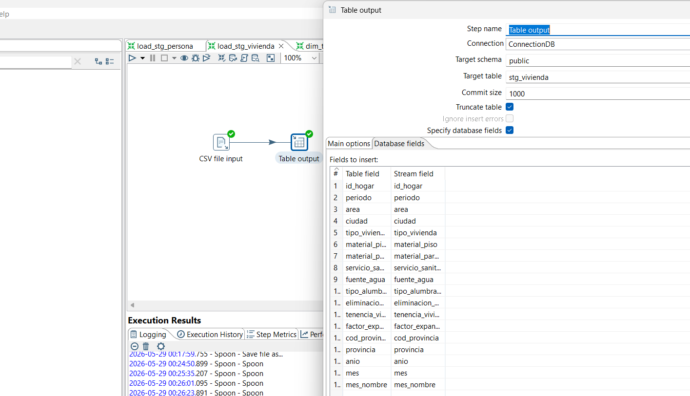 |
| :---: |
| *Figura 6: Transformación load_stg_vivienda — CSV file input → Table output* |

**Pasos:**

| # | Paso | Configuración clave |
|---|---|---|
| 1 | CSV file input | Archivo: `vivienda_limpio.csv` · Encoding: UTF-8 · `id_hogar` → String · `eliminacion_basura`, `tenencia_vivienda` → Integer (códigos sin decodificar) · `factor_expansion` → Number |
| 2 | Table output | Tabla: `stg_vivienda`  |

**Transformaciones aplicadas:** Ninguna — `eliminacion_basura` y `tenencia_vivienda` se preservan como códigos enteros para decodificarlos en Pentaho durante la carga de dimensiones.

**Row count resultante:** 26.354 filas.

---

### 3.2 Dimensiones (tiempo, geografía, persona, ocupación)

---

#### `dim_tiempo` — Dimensión temporal

**DDL de la tabla:**

```sql
CREATE TABLE dim_tiempo (
    id_tiempo           INTEGER         PRIMARY KEY,
    anio                SMALLINT        NOT NULL,
    mes                 SMALLINT        NOT NULL,
    mes_nombre          VARCHAR(10)     NOT NULL,
    orden_mes           SMALLINT        NOT NULL
);
```

**Canvas:**

| 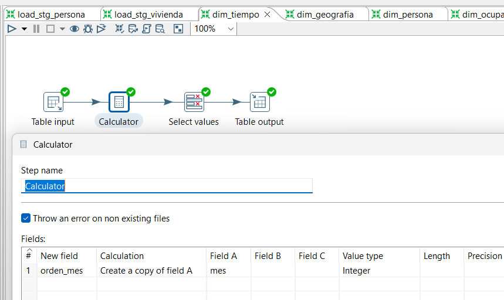 |
| :---: |
| *Figura 7: Transformación dim_tiempo — Table input → Calculator → Select values → Table output* |

**Pasos:**

| # | Paso | Configuración clave |
|---|---|---|
| 1 | Table input | `SELECT DISTINCT periodo, anio, mes, mes_nombre FROM stg_persona ORDER BY periodo` |
| 2 | Calculator | Nuevo campo `orden_mes` = copia de `mes` (tipo Integer) — necesario como Sort Column explícito en Power BI |
| 3 | Select values | Selecciona y tipifica: `periodo` (Integer), `anio` (Integer), `mes` (Integer), `mes_nombre` (String), `orden_mes` (Integer) |
| 4 | Table output | Tabla: `dim_tiempo` ·  Mapeo: `periodo → id_tiempo` |

**Transformaciones aplicadas:** Derivación de `orden_mes` a partir de `mes`. La PK `id_tiempo` toma el valor YYYYMM directamente (clave inteligente) — no usa SERIAL.

**Row count resultante:** 3 filas (202601, 202602, 202603).

---

#### `dim_geografia` — Dimensión geográfica

**DDL de la tabla:**

```sql
CREATE TABLE dim_geografia (
    id_geografia        SERIAL          PRIMARY KEY,
    cod_provincia       INTEGER         NOT NULL,
    provincia           VARCHAR(20)     NOT NULL,
    area                VARCHAR(10)     NOT NULL,
    ciudad              VARCHAR(10)
);
```

**Canvas:**

| 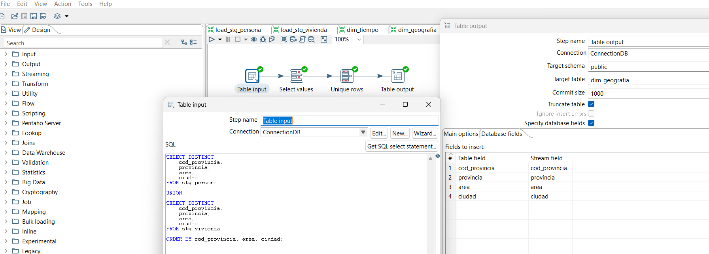 |
| :---: |
| *Figura 8: Transformación dim_geografia — Table input → Sort rows → Unique rows → Table output* |

**Pasos:**

| # | Paso | Configuración clave |
|---|---|---|
| 1 | Table input | `UNION` de combinaciones únicas `(cod_provincia, provincia, area, ciudad)` de `stg_persona` y `stg_vivienda` — se combinan ambas fuentes para garantizar completitud de la dimensión compartida |
| 2 | Sort rows | Ordenación por `cod_provincia`, `area`, `ciudad` |
| 3 | Unique rows | Deduplicación por los 4 campos |
| 4 | Table output | Tabla: `dim_geografia` ·  `id_geografia` generado por SERIAL |

**Transformaciones aplicadas:** `UNION` entre ambos datasets fuente. Se usa el código numérico de provincia y ciudad directamente (sin conversión a VARCHAR) conforme a la definición final de la tabla.

**Row count resultante:** 711 filas.

---

#### `dim_persona` — Dimensión persona

**DDL de la tabla:**

```sql
CREATE TABLE dim_persona (
    id_persona          SERIAL          PRIMARY KEY,
    sexo                VARCHAR(10)     NOT NULL,
    grupo_etario        VARCHAR(30)     NOT NULL,
    nivel_instruccion   VARCHAR(30)     NOT NULL
);
```

**Canvas:**

| 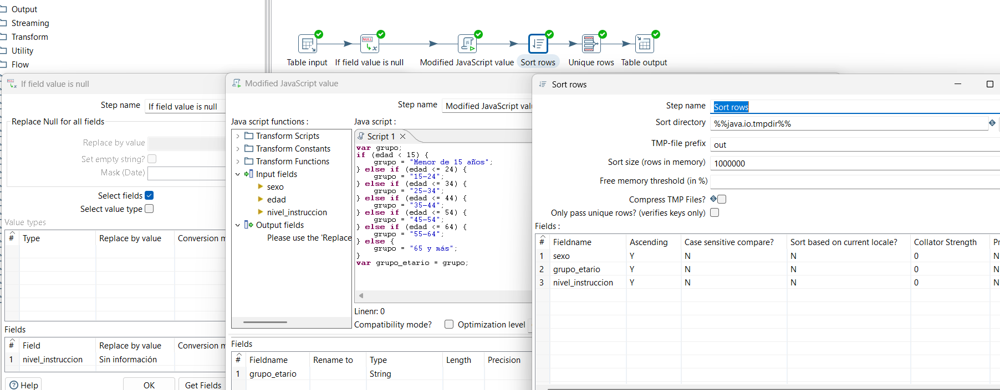 |
| :---: |
| *Figura 9: Transformación dim_persona — Table input → If field value is null → Modified JavaScript Value → Sort rows → Unique rows → Table output* |

**Pasos:**

| # | Paso | Configuración clave |
|---|---|---|
| 1 | Table input | `SELECT sexo, edad, nivel_instruccion FROM stg_persona` |
| 2 | If field value is null | `nivel_instruccion` NULL → `'Sin información'` (4.137 registros con `condicion_actividad = 'Sin información'`) |
| 3 | Modified JavaScript Value | Derivación de `grupo_etario` a partir de `edad`: `<15` → `'Menor de 15 años'`; `15–24`; `25–34`; `35–44`; `45–54`; `55–64`; `≥65` → `'65 y más'` |
| 4 | Sort rows | Ordenación por `sexo`, `grupo_etario`, `nivel_instruccion` |
| 5 | Unique rows | Deduplicación por los 3 campos |
| 6 | Table output | Tabla: `dim_persona` ·  `edad` no se carga — solo `grupo_etario` pasa al DWH |

**Transformaciones aplicadas:** Imputación de NULLs en `nivel_instruccion`. Discretización de `edad` (variable continua 0–98) en 7 bandas etarias INEC mediante script JavaScript. La columna `edad` se descarta del DWH — no tiene consumidor analítico directo.

**Row count resultante:** 62 filas (combinaciones únicas reales de sexo × grupo etario × instrucción).

---

#### `dim_ocupacion` — Dimensión laboral

**DDL de la tabla:**

```sql
CREATE TABLE dim_ocupacion (
    id_ocupacion        SERIAL          PRIMARY KEY,
    condicion_actividad VARCHAR(30)     NOT NULL,
    sector_empleo       VARCHAR(20)     NOT NULL,
    rama_actividad      VARCHAR(60)     NOT NULL,
    grupo_ocupacional   VARCHAR(60)     NOT NULL
);
```

**Canvas:**

| 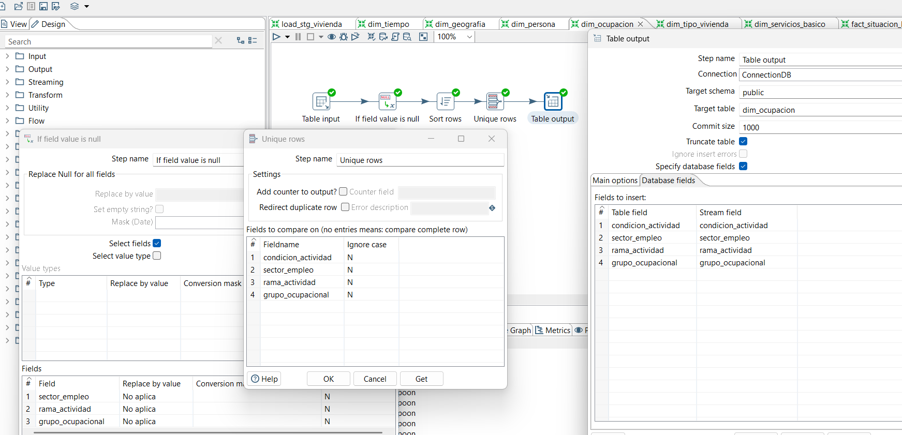 |
| :---: |
| *Figura 10: Transformación dim_ocupacion — Table input → If field value is null → Sort rows → Unique rows → Table output* |

**Pasos:**

| # | Paso | Configuración clave |
|---|---|---|
| 1 | Table input | `SELECT condicion_actividad, sector_empleo, rama_actividad, grupo_ocupacional FROM stg_persona` |
| 2 | If field value is null | `sector_empleo`, `rama_actividad`, `grupo_ocupacional` NULL → `'No aplica'` (42.974 personas fuera de PEA ocupada) |
| 3 | Sort rows | Ordenación por los 4 campos |
| 4 | Unique rows | Deduplicación por los 4 campos |
| 5 | Table output | Tabla: `dim_ocupacion`  |

**Transformaciones aplicadas:** Imputación de NULLs estructurales con `'No aplica'`. Los NULLs no son errores de datos — corresponden a personas fuera de la PEA para quienes las preguntas de ocupación no aplican.

**Row count resultante:** 968 filas (combinaciones únicas de condición × sector × rama × grupo).

---

### 3.3 Dimensiones (vivienda, servicios)

---

#### `dim_tipo_vivienda` — Dimensión de características físicas

**DDL de la tabla:**

```sql
CREATE TABLE dim_tipo_vivienda (
    id_tipo_vivienda    SERIAL          PRIMARY KEY,
    tipo_vivienda       VARCHAR(40)     NOT NULL,
    material_piso       VARCHAR(30)     NOT NULL,
    material_paredes    VARCHAR(30)     NOT NULL,
    tenencia_vivienda   VARCHAR(50)     NOT NULL
);
```

**Canvas:**

| 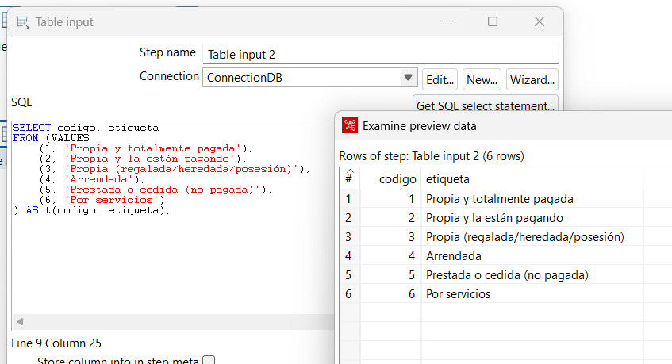 |
| :---: |
| *Figura 11: Table Input dentro de la transformación dim_tipo_vivienda* |


| 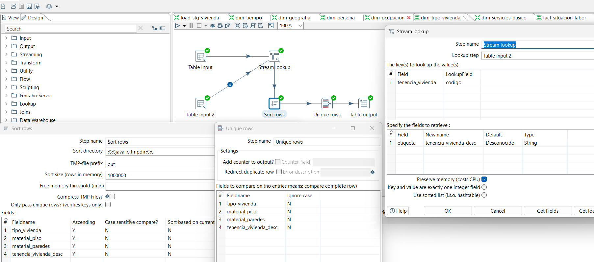 |
| :---: |
| *Figura 12: Transformación dim_tipo_vivienda — Table input → Stream lookup → Sort rows → Unique rows → Table output* |

**Pasos:**

| # | Paso | Configuración clave |
|---|---|---|
| 1 | Table input | `SELECT tipo_vivienda, material_piso, material_paredes, tenencia_vivienda FROM stg_vivienda` |
| 2 | Table input 2 (diccionario) | VALUES en línea con el diccionario INEC de tenencia: códigos 1–6 → etiquetas descriptivas |
| 3 | Stream lookup | Key: `tenencia_vivienda = codigo` · Return: `etiqueta` → `tenencia_vivienda_desc` |
| 4 | Sort rows | Ordenación por `tipo_vivienda`, `material_piso`, `material_paredes`, `tenencia_vivienda_desc` |
| 5 | Unique rows | Deduplicación por los 4 campos |
| 6 | Table output | Tabla: `dim_tipo_vivienda` ·  Mapeo: `tenencia_vivienda_desc → tenencia_vivienda` |

**Transformaciones aplicadas:** Decodificación de `tenencia_vivienda` mediante Stream lookup con diccionario INEC en memoria. Los códigos enteros (1–6) se sustituyen por etiquetas legibles antes de cargar la dimensión.

**Diccionario tenencia_vivienda:**

| Código | Etiqueta |
|---|---|
| 1 | Propia y totalmente pagada |
| 2 | Propia y la están pagando |
| 3 | Propia (regalada/heredada/posesión) |
| 4 | Arrendada |
| 5 | Prestada o cedida (no pagada) |
| 6 | Por servicios |

**Row count resultante:** 275 filas.

---

#### `dim_servicios_basicos` — Dimensión de servicios

**DDL de la tabla:**

```sql
CREATE TABLE dim_servicios_basicos (
    id_servicios        SERIAL          PRIMARY KEY,
    fuente_agua         VARCHAR(40)     NOT NULL,
    tipo_alumbrado      VARCHAR(30)     NOT NULL,
    servicio_sanitario  VARCHAR(30)     NOT NULL,
    eliminacion_basura  VARCHAR(40)     NOT NULL
);
```

**Canvas:**

| 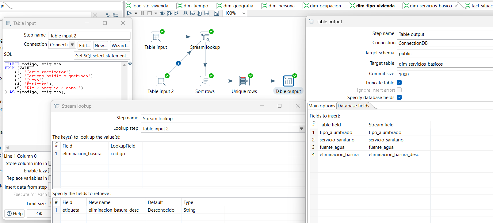 |
| :---: |
| *Figura 13: Transformación ktr_dim_servicios_basicos — Table input → Stream lookup → Sort rows → Unique rows → Table output* |

**Pasos:**

| # | Paso | Configuración clave |
|---|---|---|
| 1 | Table input | `SELECT fuente_agua, tipo_alumbrado, servicio_sanitario, eliminacion_basura FROM stg_vivienda` |
| 2 | Table input 2 (diccionario) | VALUES en línea con el diccionario INEC de basura: códigos 1–5 → etiquetas descriptivas |
| 3 | Stream lookup | Key: `eliminacion_basura = codigo` · Return: `etiqueta` → `eliminacion_basura_desc` |
| 4 | Sort rows | Ordenación por los 4 campos |
| 5 | Unique rows | Deduplicación |
| 6 | Table output | Tabla: `dim_servicios_basicos` · Mapeo: `eliminacion_basura_desc → eliminacion_basura` |

**Transformaciones aplicadas:** Decodificación de `eliminacion_basura` mediante Stream lookup. Los campos `fuente_agua`, `tipo_alumbrado` y `servicio_sanitario` ya llegaron decodificados desde el CSV — se cargan directamente.

**Diccionario eliminacion_basura:**

| Código | Etiqueta |
|---|---|
| 1 | Carro recolector |
| 2 | Terreno baldío o quebrada |
| 3 | Quema |
| 4 | Entierra |
| 5 | Río / acequia / canal |

**Row count resultante:** 137 filas.

---

### 3.4 Tablas de hechos

Las transformaciones de hechos son las más complejas del proceso ETL. Cada una realiza 4 **Database lookups** en cadena para resolver las surrogate keys de las dimensiones, partiendo de los datos de staging. A diferencia del Stream lookup (que carga la tabla en memoria), el Database lookup consulta directamente a PostgreSQL por cada fila, lo que es correcto para dimensiones ya persistidas en la base de datos.

---

#### `fact_situacion_laboral` — Hecho laboral

**DDL de la tabla:**

```sql
CREATE TABLE fact_situacion_laboral (
    id_situacion_laboral    SERIAL              PRIMARY KEY,
    nk_persona              VARCHAR(25)         NOT NULL,
    nk_hogar                VARCHAR(25)         NOT NULL,
    id_tiempo               INTEGER             NOT NULL    REFERENCES dim_tiempo(id_tiempo),
    id_geografia            INTEGER             NOT NULL    REFERENCES dim_geografia(id_geografia),
    id_persona              INTEGER             NOT NULL    REFERENCES dim_persona(id_persona),
    id_ocupacion            INTEGER             NOT NULL    REFERENCES dim_ocupacion(id_ocupacion),
    empleo                  SMALLINT            NOT NULL,
    desempleo               SMALLINT            NOT NULL,
    ingreso_laboral         NUMERIC(10,2),
    ingreso_percapita       NUMERIC(10,2),
    factor_expansion        NUMERIC(15,6)       NOT NULL
);
```

**Canvas:**

| 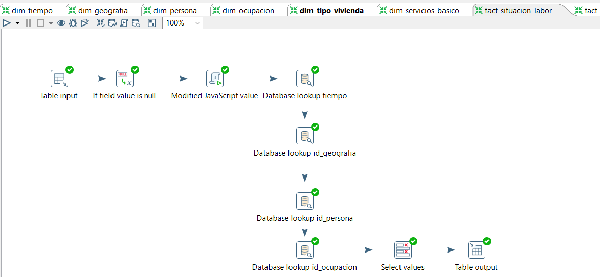 |
| :---: |
| *Figura 14: Transformación fact_situacion_laboral — flujo completo con 4 Database lookups* |

| 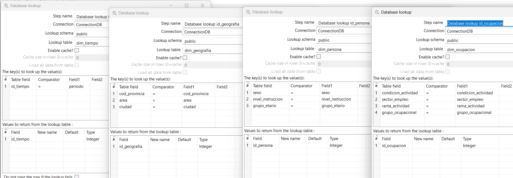 |
| :---: |
| *Figura 15: Transformación fact_situacion_laboral — Database lookup* |

**Pasos:**

| # | Paso | Configuración clave |
|---|---|---|
| 1 | Table input | `SELECT id_persona, id_hogar, periodo, cod_provincia, area, ciudad, sexo, edad, nivel_instruccion, condicion_actividad, empleo, desempleo, sector_empleo, rama_actividad, grupo_ocupacional, ingreso_laboral, ingreso_percapita, factor_expansion FROM stg_persona` |
| 2 | If field value is null | `sector_empleo`, `rama_actividad`, `grupo_ocupacional` → `'No aplica'` · `nivel_instruccion` → `'Sin información'` |
| 3 | Modified JavaScript Value | Derivar `grupo_etario` desde `edad` (misma lógica que dim_persona) · Convertir `empleo` y `desempleo` de `"true"`/`"false"` a Integer `1`/`0` |
| 4 | Database lookup (dim_tiempo) | Tabla: `dim_tiempo` · Key: `id_tiempo = periodo` · Return: `id_tiempo` |
| 5 | Database lookup (dim_geografia) | Tabla: `dim_geografia` · Keys: `cod_provincia`, `area`, `ciudad` · Return: `id_geografia` |
| 6 | Database lookup (dim_persona) | Tabla: `dim_persona` · Keys: `sexo`, `grupo_etario`, `nivel_instruccion` · Return: `id_persona` |
| 7 | Database lookup (dim_ocupacion) | Tabla: `dim_ocupacion` · Keys: `condicion_actividad`, `sector_empleo`, `rama_actividad`, `grupo_ocupacional` · Return: `id_ocupacion` |
| 8 | Select values | Selecciona únicamente los campos de la fact; renombra `id_persona (VARCHAR)` → `nk_persona` e `id_hogar` → `nk_hogar` para eliminar conflicto de nombres con las FKs |
| 9 | Table output | Tabla: `fact_situacion_laboral`  · Mapeo manual completo |

**Transformaciones aplicadas:**
- Imputación de NULLs estructurales (sector, rama, grupo, instrucción)
- Discretización de `edad` → `grupo_etario`
- Conversión de `empleo` y `desempleo` de String booleano a SMALLINT 0/1
- Resolución de 4 surrogate keys mediante Database lookup

**Verificación de integridad:**

| Consulta | Resultado |
|---|---|
| `SELECT COUNT(*) FROM fact_situacion_laboral` | **82.894** |
| NULLs en `id_tiempo` | **0** |
| NULLs en `id_geografia` | **0** |
| NULLs en `id_persona` | **0** |
| NULLs en `id_ocupacion` | **0** |

---

#### `fact_condicion_hogar` — Hecho de vivienda

**DDL de la tabla:**

```sql
CREATE TABLE fact_condicion_hogar (
    id_condicion_hogar      SERIAL              PRIMARY KEY,
    nk_hogar                VARCHAR(25)         NOT NULL,
    id_tiempo               INTEGER             NOT NULL    REFERENCES dim_tiempo(id_tiempo),
    id_geografia            INTEGER             NOT NULL    REFERENCES dim_geografia(id_geografia),
    id_tipo_vivienda        INTEGER             NOT NULL    REFERENCES dim_tipo_vivienda(id_tipo_vivienda),
    id_servicios            INTEGER             NOT NULL    REFERENCES dim_servicios_basicos(id_servicios),
    agua_potable            SMALLINT            NOT NULL,
    electricidad_red        SMALLINT            NOT NULL,
    saneamiento_adecuado    SMALLINT            NOT NULL,
    factor_expansion        NUMERIC(15,6)       NOT NULL
);
```

**Canvas:**

| 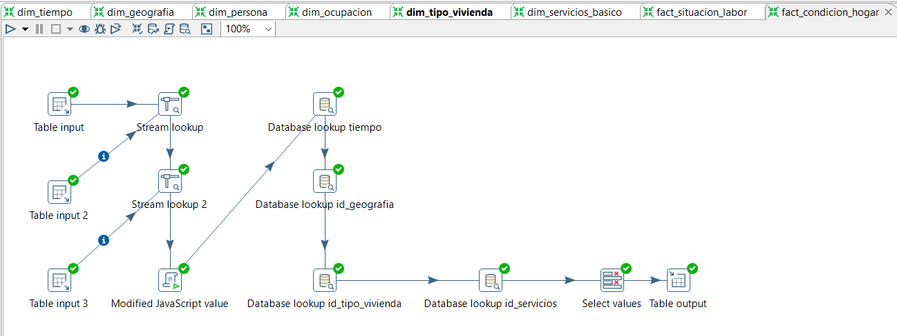 |
| :---: |
| *Figura 16: Transformación ktr_fact_condicion_hogar — flujo completo con Stream lookups y 4 Database lookups* |

**Pasos:**

| # | Paso | Configuración clave |
|---|---|---|
| 1 | Table input | `SELECT id_hogar, periodo, cod_provincia, area, ciudad, tipo_vivienda, material_piso, material_paredes, tenencia_vivienda, fuente_agua, tipo_alumbrado, servicio_sanitario, eliminacion_basura, factor_expansion FROM stg_vivienda` |
| 2 | Stream lookup (tenencia) | Decodifica `tenencia_vivienda` (códigos 1–6) → `tenencia_vivienda_desc` |
| 3 | Stream lookup (basura) | Decodifica `eliminacion_basura` (códigos 1–5) → `eliminacion_basura_desc` |
| 4 | Modified JavaScript Value | Calcula los 3 flags: `agua_potable` (1 si `fuente_agua = 'Red pública'`) · `electricidad_red` (1 si `tipo_alumbrado = 'Red de empresa eléctrica'`) · `saneamiento_adecuado` (1 si `servicio_sanitario = 'Conectado a red pública'`) |
| 5 | Database lookup (dim_tiempo) | Key: `id_tiempo = periodo` · Return: `id_tiempo` |
| 6 | Database lookup (dim_geografia) | Keys: `cod_provincia`, `area`, `ciudad` · Return: `id_geografia` |
| 7 | Database lookup (dim_tipo_vivienda) | Keys: `tipo_vivienda`, `material_piso`, `material_paredes`, `tenencia_vivienda_desc` · Return: `id_tipo_vivienda` |
| 8 | Database lookup (dim_servicios_basicos) | Keys: `fuente_agua`, `tipo_alumbrado`, `servicio_sanitario`, `eliminacion_basura_desc` · Return: `id_servicios` |
| 9 | Select values | Selecciona campos de la fact |
| 10 | Table output | Tabla: `fact_condicion_hogar` · Truncate: ✓ · Mapeo: `id_hogar → nk_hogar` |

**Transformaciones aplicadas:**
- Decodificación de `tenencia_vivienda` y `eliminacion_basura` mediante Stream lookup (mismo diccionario que las dims, para garantizar coincidencia exacta en el Database lookup posterior)
- Derivación de 3 flags binarios (medidas directas de P3) mediante JavaScript
- Resolución de 4 surrogate keys mediante Database lookup

**Verificación de integridad:**

| Consulta | Resultado |
|---|---|
| `SELECT COUNT(*) FROM fact_condicion_hogar` | **26.354** |
| NULLs en `id_tiempo` | **0** |
| NULLs en `id_geografia` | **0** |
| NULLs en `id_tipo_vivienda` | **0** |
| NULLs en `id_servicios` | **0** |

---

### 3.5 Job principal

El job `kjb_enemdu_main.kjb` orquesta la ejecución de las 10 transformaciones en el orden correcto, respetando las dependencias del modelo dimensional. Cada nodo del job es una llamada a una transformación `.ktr`; los conectores de éxito (✓ verde) garantizan que una fase no comienza hasta que la anterior terminó sin errores.

**Canvas:**

| 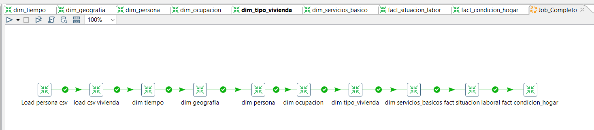 |
| :---: |
| *Figura 17: Job kjb_enemdu_main — orquestación completa de las 3 fases ETL* |

**Estructura del job:**

**Fase 1 — Staging** *(carga de datos brutos)*

```
load_stg_persona  ──✓──→  load_stg_vivienda
```

**Fase 2 — Dimensiones** *(orden obligatorio: compartidas primero)*

```
load_stg_vivienda  ──✓──→     dim_tiempo  ──✓──→  dim_geografia
                               ──✓──→  dim_persona  ──✓──→  dim_ocupacion
                               ──✓──→  dim_tipo_vivienda  ──✓──→  dim_servicios_basicos
```

**Fase 3 — Tablas de hechos** *(solo cuando todas las dims están cargadas)*

```
dim_ocupacion + dim_servicios_basicos  ──✓──→  fact_situacion_laboral
                                                ──✓──→  fact_condicion_hogar
```

**Regla de dependencias:**
- `dim_tiempo` y `dim_geografia` deben cargarse **antes** que cualquier otra dimensión o fact (son referenciadas por ambas facts).
- Las facts solo se ejecutan cuando **todas** sus dimensiones existen y están pobladas — cualquier FK sin match generaría un error de integridad referencial.
- El job puede re-ejecutarse de forma segura: todas las transformaciones tienen *Truncate table* activado, por lo que los datos anteriores se limpian antes de cada carga.

---

### Evidencia de tablas cargadas en PostgreSQL

La siguiente imagen muestra el panel de objetos de **pgAdmin** con las 10 tablas del modelo dimensional creadas y pobladas en la base de datos **DbEnemdu**, schema `public`.

| 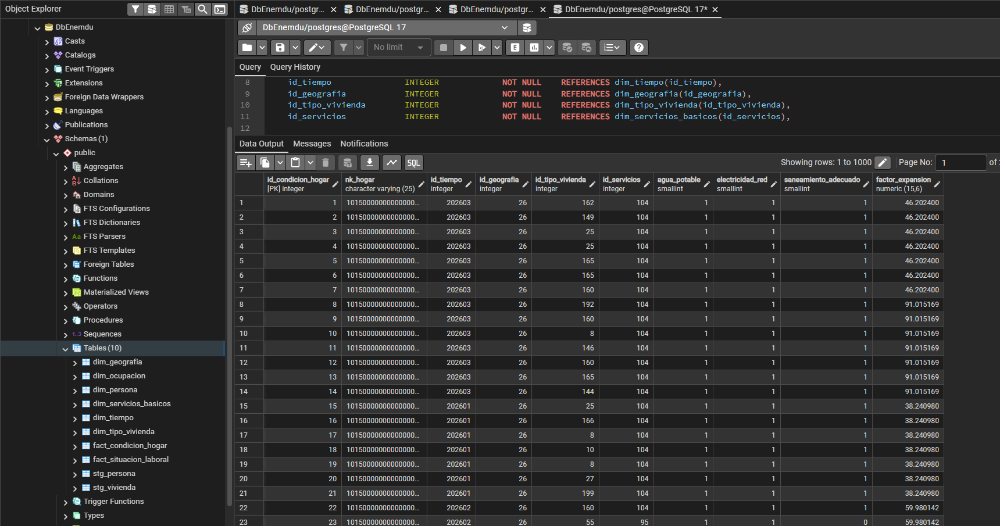 |
| :---: |
| *Figura 18: Tablas del modelo dimensional en DbEnemdu — pgAdmin* |


---
---
## 4. Análisis de insights (OLAP)
En esta fase del proyecto se utilizó Power BI Desktop para construir visualizaciones OLAP interactivas sobre el modelo dimensional implementado en PostgreSQL.
Las dimensiones compartidas `DIM_TIEMPO` y `DIM_GEOGRAFIA` permitieron analizar simultáneamente los procesos de negocio relacionados con empleo y condiciones de vivienda mediante filtros dinámicos (slicers), jerarquías y medidas DAX.

Las preguntas de negocio P1–P4 fueron respondidas mediante dashboards analíticos construidos sobre las tablas de hechos `FACT_SITUACION_LABORAL` y `FACT_CONDICION_HOGAR`.

---

### P1. ¿Cómo varía la tasa de empleo y el ingreso laboral promedio entre zonas urbanas y rurales, y entre provincias?

Para responder esta pregunta se construyó un dashboard comparativo utilizando:

* Segmentadores por provincia y área geográfica.
* Gráficos de barras para comparar la tasa de empleo.
* Tarjetas KPI para ingreso laboral promedio.
* Mapa geográfico por provincias.

Las medidas utilizadas en Power BI fueron:

```DAX
Total Empleados =
SUMX(
    FACT_SITUACION_LABORAL,
    FACT_SITUACION_LABORAL[empleo] *
    FACT_SITUACION_LABORAL[factor_expansion]
)

Tasa Empleo =
DIVIDE(
    [Total Empleados],
    SUM(FACT_SITUACION_LABORAL[factor_expansion])
)

Ingreso Promedio =
AVERAGE(FACT_SITUACION_LABORAL[ingreso_laboral])
```

### Hallazgos

* Las zonas urbanas presentan mayores niveles de empleo formal en comparación con las zonas rurales.
* Las provincias con mayor actividad económica muestran ingresos laborales promedio superiores al promedio nacional.
* Las diferencias territoriales evidencian concentración económica en determinadas regiones del país.

|                                                                  |
| :--------------------------------------------------------------------------------------------: |
| *Figura 19. Dashboard OLAP para análisis de empleo e ingresos por provincia y área geográfica.* |

---

### P2. ¿Existe una brecha salarial significativa según sexo, nivel de instrucción y sector de empleo?

Para esta pregunta se utilizaron:

* Gráficos de barras agrupadas.
* Segmentadores por sexo y nivel educativo.
* Comparación de ingresos promedio entre hombres y mujeres.

### Medidas utilizadas

```DAX
Ingreso Promedio Hombre =
CALCULATE(
    AVERAGE(FACT_SITUACION_LABORAL[ingreso_laboral]),
    DIM_PERSONA[sexo] = "Hombre"
)

Ingreso Promedio Mujer =
CALCULATE(
    AVERAGE(FACT_SITUACION_LABORAL[ingreso_laboral]),
    DIM_PERSONA[sexo] = "Mujer"
)

Brecha Salarial % =
DIVIDE(
    [Ingreso Promedio Hombre] - [Ingreso Promedio Mujer],
    [Ingreso Promedio Hombre]
)
```

### Hallazgos

* Existe una diferencia salarial observable entre hombres y mujeres en múltiples sectores laborales.
* El nivel de instrucción superior incrementa significativamente el ingreso promedio.
* La brecha salarial es más evidente en ciertos sectores económicos.

|                                                     |
| :-------------------------------------------------------------------------------: |
| *Figura 20. Dashboard OLAP para análisis de brecha salarial por sexo y educación.* |

---

### P3. ¿Qué porcentaje de hogares carece de agua potable, electricidad de red pública o saneamiento adecuado, y cómo se distribuye por provincia?

Se construyeron visualizaciones geográficas y gráficos comparativos para evaluar el acceso a servicios básicos.

### Medidas utilizadas

```DAX
% Agua Potable =
DIVIDE(
    SUMX(
        FACT_CONDICION_HOGAR,
        FACT_CONDICION_HOGAR[agua_potable] *
        FACT_CONDICION_HOGAR[factor_expansion]
    ),
    SUM(FACT_CONDICION_HOGAR[factor_expansion])
)

% Electricidad =
DIVIDE(
    SUMX(
        FACT_CONDICION_HOGAR,
        FACT_CONDICION_HOGAR[electricidad_red] *
        FACT_CONDICION_HOGAR[factor_expansion]
    ),
    SUM(FACT_CONDICION_HOGAR[factor_expansion])
)

% Saneamiento =
DIVIDE(
    SUMX(
        FACT_CONDICION_HOGAR,
        FACT_CONDICION_HOGAR[saneamiento_adecuado] *
        FACT_CONDICION_HOGAR[factor_expansion]
    ),
    SUM(FACT_CONDICION_HOGAR[factor_expansion])
)
```

### Hallazgos

* Las zonas rurales presentan menor acceso a servicios básicos.
* Algunas provincias mantienen brechas importantes en saneamiento y acceso a agua potable.
* El acceso a electricidad posee mayor cobertura respecto a otros servicios básicos.

|                                |
| :----------------------------------------------------------: |
| *Figura 21. Dashboard OLAP sobre acceso a servicios básicos.* |

---

### P4. ¿Cómo evolucionaron las tasas de empleo y desempleo durante enero, febrero y marzo de 2026?

Se utilizaron gráficos de líneas temporales utilizando la dimensión `DIM_TIEMPO`.

### Medidas utilizadas

```DAX
Total Desempleados =
SUMX(
    FACT_SITUACION_LABORAL,
    FACT_SITUACION_LABORAL[desempleo] *
    FACT_SITUACION_LABORAL[factor_expansion]
)

Tasa Desempleo =
DIVIDE(
    [Total Desempleados],
    SUM(FACT_SITUACION_LABORAL[factor_expansion])
)
```

### Hallazgos

* Las tasas de empleo y desempleo muestran variaciones mensuales moderadas durante el trimestre.
* Se identifican fluctuaciones relacionadas con dinámicas económicas temporales.
* El análisis temporal evidencia la utilidad de la dimensión tiempo en modelos OLAP.

|                                            |
| :----------------------------------------------------------------------: |
| *Figura 22. Dashboard OLAP de evolución temporal del empleo y desempleo.* |

---

### Uso de funcionalidades OLAP en Power BI

Durante el análisis se utilizaron capacidades OLAP propias de Power BI:

* Segmentadores dinámicos (Slicers)
* Drill-down jerárquico por provincia y tiempo
* Medidas DAX
* KPIs
* Visualizaciones geográficas
* Filtros cruzados entre dimensiones compartidas
* Exploración multidimensional de hechos

Estas funcionalidades permitieron realizar análisis interactivos y responder preguntas de negocio de manera visual y eficiente.


---
---
## 5. Recomendaciones al negocio

Con base en los hallazgos obtenidos mediante el análisis OLAP realizado sobre los datos ENEMDU Q1 2026, se proponen las siguientes recomendaciones orientadas a políticas públicas y toma de decisiones estratégicas:

### 1. Fortalecer programas de empleo en zonas rurales

Los resultados muestran diferencias importantes entre zonas urbanas y rurales en indicadores de empleo e ingresos.
Se recomienda fortalecer programas de inserción laboral y capacitación técnica en sectores rurales para reducir las brechas territoriales identificadas.

### 2. Impulsar políticas de igualdad salarial

La existencia de diferencias salariales según sexo y nivel educativo evidencia la necesidad de promover políticas de igualdad de oportunidades y transparencia salarial, especialmente en sectores económicos donde la brecha es más significativa.

### 3. Priorizar inversión en servicios básicos

Las provincias con menor acceso a agua potable y saneamiento adecuado requieren atención prioritaria mediante inversión pública en infraestructura básica y cobertura de servicios esenciales.

### 4. Mantener monitoreo periódico del mercado laboral

El análisis temporal demuestra que los indicadores laborales presentan variaciones mensuales relevantes.
Se recomienda mantener procesos de monitoreo continuo utilizando herramientas de Business Intelligence que permitan detectar tendencias de manera temprana.

### 5. Consolidar plataformas de análisis basadas en BI

La implementación de un modelo dimensional junto con Power BI permitió integrar múltiples dimensiones de análisis y facilitar la exploración interactiva de datos.
Se recomienda continuar utilizando arquitecturas BI para apoyar procesos de planificación, evaluación y toma de decisiones basadas en evidencia.


---
---
## Referencias Bibliográficas   
<a name="referencias"></a>
[1] Instituto Nacional de Estadística y Censos (INEC), "Estadísticas Laborales – abril 2026: Encuesta Nacional de Empleo, Desempleo y Subempleo (ENEMDU)," INEC Ecuador, 2026. [En línea]. Disponible en: https://www.ecuadorencifras.gob.ec/estadisticas-laborales-enemdu/ [Accedido: 27 de Mayo, 2026].
